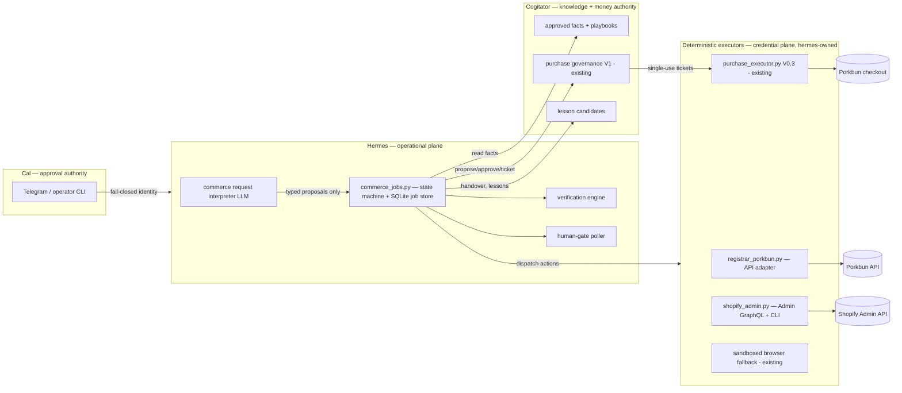

# Governed Ecommerce Launch Executor — Codex Execution Package (v2)

**Second-pass technical planning and self-review. Produced 2026-07-24 by Fable (Claude Code).**
Supersedes the v1 report on this branch. Research/architecture/planning only — no production code, purchases, or provider mutations were made while producing it.

Evidence tags: **[V]** verified in repository/GitHub · **[D]** verified in current official provider documentation (retrieval date given) · **[I]** engineering inference · **[U]** unresolved, requires live verification.

**Input note:** the "GPT critique" referenced by the assignment was not provided in-session and no critique document exists in either repository (`plans/`, Cogitator `docs/hermes/` searched [V]). This revision is therefore an independent second pass against repo + provider evidence only.

**Material decisions changed from v1** (full rationale inline):
1. Operational commerce-job store moved from Cogitator SQLite to a **Hermes-owned SQLite database**.
2. Issue #65 live browser-purchase acceptance reclassified from *strict prerequisite* to **parallel safety milestone**; the registrar-API purchase path gets its **own** supervised acceptance gate.
3. First-release validation method changed from Downpay deposit app to **full-payment preorder** (deposits deferred).
4. Porkbun *API-based registration* downgraded from assumed-supported to **[U]** with a verified fallback (the existing browser purchase executor, already Porkbun-allowlisted [V]).
5. Test checkout re-sequenced: Shopify **test orders require a paid plan [D]**, so plan selection/subscription approval must precede test checkout, and test mode must be disabled before public launch.
6. No custom theme in v1: **Dawn (default free theme) + pages + theme settings**, snapshot in git via Shopify CLI.

---

## 1. Executive verdict

**What already exists (verified, merged, security-reviewed) [V]:**
- A complete governed **outgoing-purchase control plane** in Cogitator (`cogitator_purchase_governance.py`, 1,871 lines; PRs #1053/#1054/#1056/#1057/#1059/#1061 merged; `docs/PURCHASE_GOVERNANCE_V1.md`): exact-quote approvals, atomic budget reservations, single-use hashed audience-bound execution tickets (5-min TTL), 15-min approval TTL, idempotency fingerprints, term-mismatch invalidation, uncertain-result reconciliation, sanitized receipts, refunds, asset registry, append-only audit events.
- A deterministic one-shot **browser purchase executor** in hermes (`purchase_executor.py` V0.3, PR #76 `0bfbec94b`; `purchase_discovery.py`, `purchase_merchants.py`), with hardened systemd packaging (`packaging/purchase-executor/`), operator CLI (`scripts/purchase_operator_cli.py`), 108+ passing tests, two Chromium fake-E2Es, independent Security and Build review PASS (issue #65 comment 2026-07-22).
- Fail-closed **user identity gating** (`gateway/authz_mixin.py`; Telegram deny-by-default allowlist, `gateway/platforms/telegram.py:574-582`).
- A **sandboxed local browser** with mandatory cleanup (`sandbox_bypass: never`, recording off, private URLs blocked — `~/.hermes/config.yaml` browser section [V]; acceptance closed 2026-07-18 per #65 spec).
- Cogitator **approved-knowledge flow**: promoted retrieval records, provenance, human review, no auto-promotion, lesson candidates [V].

**Partially complete:** durable-job patterns (research jobs, purchase lifecycle) exist but there is no commerce job object; approval identity is a confirmation phrase, not bound to a hardware factor; merchant allowlist is Porkbun-only; renewal data exists (`purchase_assets`) without alerting.

**Genuinely new:** registrar/DNS API adapter, commerce job state machine + Hermes job store, provider-account verifier, Shopify Admin adapter + theme snapshot flow, grounded page/copy builder, verification engine, human-gate polling, handover/lessons.

**Blocks the first release (true blockers):**
- **B1** Missing business facts (entity/ABN, brand, SKU, price, preorder terms) — Cal input, gates the acceptance case not the build.
- **B2** Shopify store does not exist; creation is dashboard-manual [D] — a ~15-minute Cal gate.
- **B3** Porkbun API registration capability/funding unverified [U] — resolved by S1 read-only discovery; fallback path exists either way.
- **B4** Payment credential staging (`systemd-creds`, Cal sudo) if the browser-executor purchase path is used [V].

**The one recommended path:** extend the proven control-plane/executor split — Hermes owns a new commerce job state machine and deterministic provider adapters; Cogitator remains the sole authority for money (proposals→approvals→tickets) and approved facts; the first supervised live action is the **governed domain registration**, and the first customer-facing milestone is a **password-protected Shopify store with one full-payment preorder product, verified by a test order on the Bogus gateway**, followed by Cal-approved public launch.

| Area | Completed | Partial | Missing |
|---|---|---|---|
| Outgoing-purchase governance | ✅ | | |
| Browser purchase executor + packaging | ✅ (live acceptance pending) | | |
| Identity gating, sandboxed browser, audit | ✅ | | |
| Durable commerce job + state machine | | | ❌ |
| Registrar/DNS API adapter | | | ❌ |
| Shopify adapter/theme/store flow | | | ❌ |
| Provider-account verification | | | ❌ |
| Verification engine, human-gate polling | | | ❌ |
| Approved AMD business facts | | | ❌ |
| Cogitator knowledge/lesson flow | ✅ | | |

---

## 2. Recovered repository and worktree state (re-inspected 2026-07-24, post-fetch)

### hermes-agent (`/home/v0id/.hermes/hermes-agent`; origin `3ndym10n/hermes-agent`, upstream `NousResearch/hermes-agent`) [V]
- `origin/main` = **`8bd8bfe6045a9b193afaec5026cc9cf5a5641b16`** (Linxio sent-mail style bootstrap, #84). Local `main` = `5600ea084` (behind 2 commits after the fetch; fast-forwardable; intentionally left untouched).
- This branch `review/ecommerce-launch-executor-plan` = `3918cf698` (v1 report), pushed.
- Working tree otherwise clean. Worktrees: `hermes-agent-bulk-style` (detached `8bd8bfe60`, clean), `hermes-agent-google` (`feat/linxio-selected-source-lessons`, clean except two zero-byte junk files `--auth-code`, `--service-profile` — no secrets, ignorable), `/tmp/hermes-intelligent-intake-x-article-recovery` (clean).
- Open issues: **#65** (purchase executor — held open for the supervised live acceptance), #77 (Linxio), #43 (async research replies). **No open PRs; no closed-unmerged PRs.**

### Cogitator (`/home/v0id/Projects/Cogitator_clean`; origin `3ndym10n/Cogitator`) [V]
- `origin/main` = **`ffc35642113bda9de440b89c692801a47eaba429`**. Recent purchase-relevant merges: `462d3fd` "Bind exact checkout terms into purchase tickets" (#1061), `11737bf` checkout targets (#1059), `809db08` operator bridge (#1057).
- Local checkout on `agent/purchase-operator-bridge-v0` @ `809db08` — **merged into origin/main**; local is simply behind. `feat/purchase-ticket-terms-v0` is patch-equivalent merged (`git cherry` = `-`; `462d3fd` on main). Nothing stranded.
- Untracked: `docs/hermes/` (copies of three hermes plan docs incl. `PURCHASE_EXECUTOR_V0_ISSUE_SPEC.md`), `storage/intake/*` capture files — data/notes, preserve untouched.
- ~19 worktrees (lanes 557–572, 606/607, purchase-*, linxio) — **all clean** [V]. Stale; prune is optional housekeeping, not done.
- Open PRs #794, #793 (June, unrelated). Open issues include #1003 (AMD venture flywheel), #1019 (ISB V1).

**Safe-to-preserve statement:** every branch, worktree, and untracked file listed above is untouched by this plan; the only repository change on this task is this report on this branch.

### Business-fact state [V]
- `storage/promoted/2026-06-30-ai-first-ecommerce-validation-playbook.md` (approved): validate demand via preorder/deposit before building store infrastructure.
- `docs/research/RAW_BUSINESS_AI_GPU_INTAKE_PACKET_V0.md`: **no GPU/AMD/supplier facts exist** — the "gpu" raw dump contained none. No brand, domain, pricing, warranty, supplier, or preorder-term decisions exist anywhere in either repo.

---

## 3. Existing capability map

(Condensed; unchanged findings from v1 re-verified against `origin/main` where they matter.)

| Capability | State | Evidence |
|---|---|---|
| Exact-quote approval, one-time tickets, TTL, replay/stale rejection | verified complete | `cogitator_purchase_governance.py` (`APPROVAL_TTL_SECONDS`, `EXECUTION_TICKET_TTL_SECONDS`, hashed tokens, constant-time compare) [V] |
| Budgets/reservations/idempotency/receipt sanitisation/reconciliation/assets/audit | verified complete | same module; tables `purchase_budgets…purchase_refunds`; `docs/PURCHASE_GOVERNANCE_V1.md` [V] |
| Checkout-term binding into tickets | verified complete | `462d3fd` on main; `checkout_target` normalization at `cogitator_purchase_governance.py:450` [V] |
| One-shot deterministic checkout executor, no model calls, credential isolation, single submit, cleanup-always | verified complete (code); live acceptance pending | `purchase_executor.py` docstring + tests; issue #65 comments [V] |
| Merchant allowlist | Porkbun only | `purchase_merchants.py` (`V0 live allowlist: Porkbun only`) [V] |
| systemd hardening + credential staging pattern | verified complete | `packaging/purchase-executor/*.service`, `cal-gate.sh` [V] |
| Operator control surface | verified complete | `scripts/purchase_operator_cli.py`; Cogitator operator bridge [V] |
| Identity gating | verified complete | `gateway/authz_mixin.py`; Telegram fail-closed allowlist [V] |
| Sandboxed browser + cleanup | verified complete | config keys `sandbox_bypass: never`, `record_sessions: false`, `allow_private_urls: false`; `cleanup_browser` API [V] |
| Durable NL→job routing pattern | partial (research jobs only) | gateway research bridges (#62) [V] |
| Approved-fact retrieval, provenance, review, no-auto-promotion, lesson candidates | verified complete | promoted records; ISB flow [V] |
| Registrar API / DNS management / Shopify code / commerce job / account verifier / verification engine | missing | no code in either repo (searches over `git ls-files` + `git grep`) [V] |
| Shopify knowledge | documented but absent | `optional-skills/productivity/shopify/SKILL.md` is a skill doc, not an adapter [V] |

---

## 4. Gap analysis

Every gap is one of four kinds:

1. **New deterministic adapters** (registrar/DNS, Shopify Admin, verification): pure new code in hermes, testable offline against fakes.
2. **New durable commerce-job layer** in Hermes: state machine, job store, fingerprints, gates, recovery. Patterns proven in Cogitator purchase lifecycle [V]; the code is new.
3. **Governance policy extension** in Cogitator: a `commerce_launch_v1` policy (larger budget, classes for `saas_subscription`/`app_subscription`/theme) — an additive change inside the existing, preserved module. No new money machinery.
4. **Facts and human accounts**: Cal-supplied (B1, B2 above); technically trivial, sequentially gating.

Nothing in the existing purchase stack needs replacement. The one structural decision the v1 report got wrong is job-store placement (next section).

---

## 5. Architecture recommendation

### The decision that matters: where operational commerce state lives

**Recommendation (changed from v1): the commerce job store is a Hermes-owned SQLite database at `~/.hermes/commerce/commerce_jobs.db`, schema and migrations owned by `hermes-agent` (new module `commerce_jobs.py`).** Cogitator keeps exclusive ownership of purchase proposals, approvals, budgets, reservations, tickets, receipts, assets, refunds, and audit events — untouched.

Evidence and reasoning:
- The non-negotiable ownership split assigns job lifecycle, restart recovery, and provider execution to Hermes and forbids Cogitator becoming the ecommerce runtime. Physical placement should follow operational ownership here because every job-state write would otherwise be a network round-trip through the bridge, making Cogitator availability a hard dependency of *every* step, including steps with no knowledge or money content [I].
- Hermes already operates durable local SQLite state (`~/.hermes/state.db`, `kanban.db` [V]) — a commerce DB follows an existing operational pattern, not a new one.
- The proven Cogitator SQLite idioms (`BEGIN IMMEDIATE`, unique idempotency fingerprints, append-only event tables, additive `init_db`-style migrations [V]) are *patterns to copy into* `commerce_jobs.py`, not a reason to co-locate tables.

**Strongest rejected alternative:** commerce-job tables inside Cogitator's governed SQLite (v1's position). Rejected because it makes Cogitator the ecommerce runtime in fact (every transition lands there), couples all execution to bridge availability, and blurs the exact boundary this assignment requires resolving. Its one real advantage — a single audit store — is preserved anyway, because every *financial* event still lands in `purchase_events` and every job carries the Cogitator proposal/approval IDs it referenced. Confidence: high. Would change if: Hermes lost durable-state responsibilities entirely (no evidence of that).

### Boundary contract (Hermes ⇄ Cogitator)

| Interface | Direction | Transport | Content |
|---|---|---|---|
| Approved-fact retrieval | Hermes → Cogitator | existing bridge (`/api/cogitator_bridge`, bearer token) [V] | retrieval records + provenance; read-only |
| Purchase proposal / approval / ticket / result | Hermes → Cogitator | existing operator + executor bridge actions [V] | exact-quote money flow; Cogitator authoritative |
| Lesson candidates / launch handover | Hermes → Cogitator | existing lesson-candidate intake [V] | proposed knowledge, human-reviewed, never auto-promoted |

Dependencies flow **one way: Hermes → Cogitator**. Cogitator never calls into Hermes [V — matches every existing bridge].

**Availability behaviour:** Cogitator down ⇒ commerce jobs continue read-only/safe local work, and any step needing facts, approvals, or tickets parks in a `blocked_on_cogitator` sub-status with retry/backoff; no money can move (fail-closed by construction, since tickets are unobtainable). Hermes down ⇒ nothing executes; Cogitator state is consistent (reservations/tickets expire on TTL [V]).

**Why Hermes cannot bypass purchase governance:** (a) payment credentials exist only inside the root-owned executor units via `$CREDENTIALS_DIRECTORY` — the gateway/LLM plane has no path to them [V]; (b) the executors refuse to run without a valid single-use governance ticket [V]; (c) the registrar purchase leg (S5) reuses the same ticket-gated executor pattern; (d) provider API keys for *mutating* adapters are staged the same way, and the adapters check a job-store approval reference before any consequential call — enforced by code review + tests (T-gov series, §20). The trust anchor is credential placement, not politeness [I].

**Why Cogitator cannot become the runtime:** it exposes only the bridge actions above; it holds no provider adapters, no browser, no job tables, and its schemas reject operational/credential fields (`FORBIDDEN_FIELD_TOKENS` [V]).

### Component diagram



Trust boundaries: Cal↔Hermes (identity allowlist); LLM↔deterministic (typed schemas; LLM output is proposal data); Hermes↔Cogitator (bearer bridge; one-way); executors↔providers (origin/domain allowlists; responses untrusted); credential plane (systemd credstore / 0700 secrets; never crosses inward to LLM or Cogitator).

**Failure model:** every provider mutation is (idempotency-keyed where the provider supports it [U per provider], single-attempt where irreversible [V house rule]); process crash ⇒ job store is the restart truth; an interrupted mutation whose outcome is unknowable from the response is an **uncertain external state** (defined: a write was dispatched, no definitive success/failure evidence was recorded, and re-issuing could double-execute). Recovery = provider re-read reconciliation, human decision on conflict — the exact model purchase governance already implements [V], generalized.

**Fingerprints:** `plan_fingerprint` = SHA-256 over the canonical JSON of approval-material fields (§7 list). `action_fingerprint` = SHA-256 over the action envelope minus timestamps. Approvals bind to fingerprints; any material change recomputes and orphans only the affected approvals. This generalizes the existing terms-fingerprint mechanism (`462d3fd`) [V].

**Duplicate prevention:** job-level unique key `(requester, normalized_objective, active)` — a second "launch the GPU store" request attaches to the live job instead of creating one; action-level idempotency keys + provider-side idempotence (Shopify GraphQL mutations are idempotent per input for upserts keyed on handle [I]; Porkbun [U]).

### Smallest-sound justification
One new DB, two new adapters, one policy extension, zero new services/queues/frameworks; every security-critical mechanism (money, tickets, credentials, sandboxing, identity) is reused, not rebuilt.

---

## 6. Source-of-truth matrix

| Data | Authoritative owner | Placement |
|---|---|---|
| Business identity, ABN, legal name | Cal + government registries | cached as approved Cogitator facts w/ provenance |
| Brand, product facts, pricing, warranty, preorder terms, supplier facts | Cogitator approved records | `storage/promoted/` + review flow [V] |
| Commerce job state, plan fingerprints, gate ledger | **Hermes** | `~/.hermes/commerce/commerce_jobs.db` (new) |
| Purchase proposals, approvals, budgets, reservations, tickets, receipts, assets, refunds, purchase audit | **Cogitator** (unchanged) | existing eight tables [V] |
| Provider credentials / payment instrument | systemd credstore; `~/.hermes/secrets` (0700 [V]) | never Cogitator, never LLM |
| Domain ownership, DNS live state, Shopify live state, payment readiness | Provider APIs | always re-read; never trusted from cache |
| Theme snapshot + deterministic code | Git (hermes-agent) | `commerce/theme/` snapshot dir (new) |
| Product configuration | Shopify Admin API (live) + desired-state spec in job | |
| Customer order/card data | Shopify exclusively | Virgil reads order summaries only |
| Recurring subscriptions | `purchase_assets` [V] + provider truth | |
| Human approval authority | Cal, recorded in Cogitator approvals + job gate ledger | |
| Launch handover, post-launch lessons | Cogitator lesson-candidate review | no auto-promotion [V] |

---

## 7. Commerce job state machine (v1 of the machine; `state_machine_version = 1`)

Persisted in the Hermes job store; every transition appends to `job_events` (append-only). Global rules: consequential/irreversible actions are **never retried automatically** [V house rule]; idempotent reads retry 3× exponential backoff; default state timeout 72 h → `paused` with a Cal notification; recovery on restart = load job, verify provider truth for the in-flight action, then resume or park as uncertain.

| State | Entry condition | Permitted actions | Required approvals | Persisted evidence | Exit → | User message |
|---|---|---|---|---|---|---|
| `requested` | Cal-verified typed request | create job (dedupe check) | — | request text, requester id | `recovering_existing_state` | "Checking what already exists…" |
| `recovering_existing_state` | job created | read-only: job store, Cogitator assets/facts, provider reads if accounts exist | — | recovery report JSON | `needs_business_facts` \| `planning` | recovered-state report |
| `needs_business_facts` | fact gaps found | render missing-facts packet; accept Cal answers → Cogitator review | Cal supplies facts | gap list, fact record ids | `planning` | missing-facts packet |
| `planning` | facts sufficient | LLM plan draft; live price re-quotes via adapters (read-only) | — | plan JSON + fingerprint | `plan_ready` | — |
| `plan_ready`/`awaiting_decision_packet` | plan fingerprinted | render decision packet | **all bound approvals**: domain purchase (exact, via Cogitator), Shopify subscription (recurring), any app/theme | approval refs ↔ fingerprints | `ready_to_execute` | decision packet |
| `ready_to_execute` | approvals live, fingerprint match | dispatch next action | per-action | action ledger row | per-plan next state | job status |
| `registering_domain` | domain approval live | Cogitator proposal→ticket→executor (API leg or browser leg) | already bound | proposal/ticket ids, receipt ref | `configuring_dns` \| `uncertain_external_state` | "Registering {domain}…" |
| `configuring_dns` | domain owned (provider-verified) | dns snapshot → preview → apply → verify | diff-hash approval if deletions/protected-class changes | zone snapshot id, diff hash | `awaiting_store_creation` | DNS diff summary |
| `awaiting_store_creation` (human gate) | no store exists | poll: none (Cal acts) | — | gate opened ts | Cal supplies store domain + custom-app token staged | gate card G1 |
| `configuring_shopify` | store reachable, account verified (§8) | shop identity read; settings reads | — | shop id/currency snapshot | `building_store` | progress |
| `building_store` | identity verified | product/page/policy upserts; theme settings push (unpublished preview); password page on | — | upsert results, theme snapshot commit | `configuring_checkout` | progress |
| `configuring_checkout` | content built | test-gateway enablement check; test order via Bogus gateway; order verify/cancel via Admin API | — | test order id + evidence | `awaiting_payment_activation` | test-order report |
| `awaiting_payment_activation` (human gate) | real payments needed | poll `payments.readiness` via Admin API | — (Cal completes KYC/bank on Shopify) | poll log | `verifying` | gate card G5 |
| `verifying` | build+payments ready | full checklist (§20 T-verify): DNS, SSL, redirects, pages, policies, product, placeholder scan, claim-grounding re-check | — | evidence bundle (screenshots+API reads) | `awaiting_public_launch_approval` \| `verification_failed` | verification report |
| `verification_failed` | any check failed | diagnose; re-plan | re-approval only if material fields changed | failure evidence | `planning` \| `building_store` | failure + evidence |
| `uncertain_external_state` | dispatched write, unknowable outcome | provider re-reads only | — | last action, response fragments (sanitized) | `awaiting_reconciliation` | uncertainty warning |
| `awaiting_reconciliation` | uncertainty recorded | render reconcile packet; Cal/operator decides | human decision if provider truth conflicts | reconciliation record | `ready_to_execute` \| `failed` | reconcile packet |
| `awaiting_public_launch_approval` | verification passed | render launch packet (incl. "test mode will be disabled") | **public-launch approval** | approval ref | `launching` | launch card |
| `launching` | approved | disable test mode; remove store password; final domain/SSL re-verify | bound | evidence | `live` | — |
| `live` | store public | post-launch checks (order email, uptime, analytics presence) | — | health snapshot | `completed` | — |
| `completed` | handover + lessons filed | — | — | handover doc ref | terminal | handover |
| `paused` | operator or timeout | resume/cancel | — | pause reason | `ready_to_execute` \| `cancelled` | status |
| `cancelled` / `failed` | operator / unrecoverable | release Cogitator reservations via existing cancel paths [V] | — | terminal record | terminal | summary |
| `rolling_back` → `rolled_back` | Cal approves rollback proposal | inverse actions where defined: DNS snapshot restore, theme revert, re-password store; **domain purchase not reversible** (disclosed at approval) | rollback approval | inverse-action ledger | terminal | rollback report |

**Approval-material fields (plan fingerprint):** domain name/TLD/registrar/provider-account, every price+currency, term length, auto-renew, recurrence of any subscription, Shopify plan tier, product price, launch date, provider-account substitution. Non-material: copy edits, styling, page order, image swaps (subject to claim-grounding). Per-action binding means unchanged actions keep their approvals; only re-fingerprinted actions are re-requested [V pattern, generalized].

---

## 8. Provider-account and credential model

**Rule:** before any consequential action, the adapter re-reads account identity from the provider and matches it to the job's pinned `account_ref`; mismatch ⇒ invalidate that provider's pending approvals and park the job. Accounts are never inferred from filenames, paths, usernames, or history.

| Provider | Identity read | Pinned fields | Environment check |
|---|---|---|---|
| Porkbun | auth ping + domain list [D 2026-07-24, porkbun.com/api/json/v3/documentation] | API-key fingerprint (SHA-256 of key id, never the key), account label Cal assigns | n/a (single production API; fake server used in tests) |
| Shopify | Admin GraphQL `shop { id name email myshopifyDomain currencyCode plan { partnerDevelopment displayName } }` [D shopify.dev 2026-07-24] | shop id, myshopifyDomain, currency | `plan.partnerDevelopment` ⇒ dev store; production writes refuse against dev-tagged account and vice versa |

**Credentials:**
- Porkbun API key+secret: staged into the registrar executor context only — systemd credentials for the mutating one-shot unit; for read-only dev/test, env-injected from `~/.hermes/secrets` (0700 [V]). Porkbun supports per-key IP/domain restrictions and keys work independently of account 2FA [D 2026-07-24] — restrict the key to this host's egress IP.
- Shopify Admin token: from a merchant-created **custom app** (Dev Dashboard; store owners have full create/manage access) [D help.shopify.com/manual/apps/app-types/custom-apps, 2026-07-24]. Cal creates the app and stages the token (single hand-off into the secrets store; Virgil never sees it in chat). Scope minimization (§10). Rotation = Cal regenerates in admin + restages; revocation = uninstall the custom app. Exact scope names and token-display mechanics **[U — confirm in S6 against the Dev Dashboard flow]**.
- Payment instrument for the browser executor leg: unchanged — `systemd-creds encrypt` into `/etc/credstore.encrypted`, root-only, Cal-sudo staged [V].
- Prohibited everywhere outside the credential plane: passwords, tokens, cookies, card data, identity documents (matches Cogitator `FORBIDDEN_FIELD_TOKENS` [V]; the Hermes job store adopts the same forbidden-field screen on every persisted payload — test T-sec-2).

---

## 9. Registrar and DNS strategy

**Primary registrar: Porkbun. Confidence: high for DNS + pricing + availability; medium for API-registration until S1 discovery.**

Verified [D 2026-07-24 unless noted]:
- Official API v3 (`https://api.porkbun.com/api/json/v3`) covering "domains, DNS, SSL, email forwarding"; auth via `apikey`/`secretapikey` (headers or body); per-key IP/domain restrictions; 2FA-independent keys (porkbun.com/api/json/v3/documentation).
- `GET /domain/getRegistrationRequirements/{tld}` returns whether a TLD is **API-registerable** plus the registration payload schema — implying an API registration endpoint exists for eligible TLDs.
- Pricing endpoint (`/pricing/get`) for default TLD pricing; DNS retrieve/update; nameserver update (unofficial OpenAPI mirror consistent with official doc).
- .au is sold (porkbun.com/tld/au). `.com.au` availability-via-API **[U]**.

Unresolved **[U — S1 discovery items, all read-only]:** exact registration endpoint name/shape; whether registration charges account balance or stored payment method; per-key spend limits (none documented); documented rate limits; `.com.au` API registerability.

**Exact-cost approval binding:** the decision packet quotes live prices from `/pricing/get` at packet time; the Cogitator proposal carries `final_quoted_total` and approval must equal it exactly [V mechanism]. **Cached or third-party prices are never approval amounts** — re-quote at proposal creation; if re-quote ≠ packet quote, the packet is re-rendered (fingerprint change).

**Two registration legs, one governance flow (both wrapped in proposal→approval→ticket):**
- **Leg A (preferred): API registration** via a new deterministic one-shot `registrar executor` that claims the ticket, calls the registration endpoint once, and reports exactly one terminal result — the same skeleton as `purchase_executor.py` minus the browser [I]. Funding model [U] determines whether the payment instrument is "account balance" (pre-funded by Cal — itself a governed purchase) or card-on-file (Cal-staged in Porkbun account).
- **Leg B (verified fallback): the existing browser purchase executor**, whose live allowlist is already exactly Porkbun [V]. If S1 discovery finds API registration unavailable/unsuitable, the launch is not blocked.

**Idempotency/uncertainty:** registration is irreversible + single-attempt; a timeout after dispatch is an uncertain external state; reconciliation = re-read domain list — domain present ⇒ record completed (with receipt from account history [U format]); absent ⇒ definitive failure. Identical to the governance model [V].

**Fallback registrar: Cloudflare Registrar** (registration API launched 2026, beta [D startuphub.ai + developers.cloudflare.com 2026-07-24]) — .com-class only, requires Cloudflare NS (DNS-only mode for the Shopify records) [I]. **Deferred** — no adapter in first release. `.com.au` if Cal requires it: an AU registrar adapter (Synergy Wholesale has a reseller API + sandbox [I/U]) — **deferred pending Cal's TLD decision**; auDA eligibility (ABN/ACN/exact-match TM; loss ⇒ cancellation within 24 h) is registrar/auDA's validation, not Virgil's [D auda.org.au 2026-07-24].

**First-release TLDs: `.com` (and `.net` as free alternate)** — flat, API-registerable-expected, no eligibility documents. `.com.au` deferred to a follow-up slice gated on Cal's entity decision.

**DNS desired-state model:** fetch full zone → classify records: **protected** (NS, MX, SPF/DKIM/DMARC TXT, verification TXT), **flagged** (existing apex/www A/AAAA/CNAME), **free**; compute add/change/delete; write zone snapshot JSON (job evidence, rollback source); deletions or protected-class changes require diff-hash-bound approval; unrelated records always preserved; apply; verify by API re-read plus multi-resolver lookups. Rollback = restore snapshot (deterministic, non-approval since it restores prior approved state, unless protected records changed meanwhile ⇒ re-diff).

Shopify connection records [D help.shopify.com 2026-07-24]: apex A `23.227.38.65`, AAAA `2620:0127:f00f:5::`, `www` CNAME `shops.myshopify.com.`; only one apex A / www CNAME pair; up to 48 h propagation. Verification: Shopify admin domain status via Admin API [U exact field] + direct resolution + HTTPS certificate check + root↔www redirect check both directions.

---

## 10. Shopify strategy

**Store creation (B2):** No public API creates stores [D community.shopify.com confirmation, 2026-07-24]. Partner dev stores are dashboard-manual too. **Recommendation: Cal creates the store directly via standard Shopify signup** (not a Partner dev store) because the acceptance case requires a paid plan anyway — test orders require a paid plan [D help.shopify.com/manual/checkout-settings/test-orders 2026-07-24] — and dev-store→paid transfer adds steps without benefit for a single-store operator. **Strongest rejected alternative:** Partner dev store first (free build time) — rejected because plan selection is required before the test-checkout milestone regardless, and transfer/ownership steps add a second human gate. Confidence: medium-high. Would change if: Cal wants an extended unpaid build period.

**Auth:** custom app in the store's Dev Dashboard → Admin API access token (§8) [D]. **Minimum scopes (target set, exact names [U] to pin in S6):** products write, content/pages write, themes write, orders read (verification), shop read. No customer-PII scopes in v1 — order verification uses order status/amounts, not customer objects; if the orders scope unavoidably includes addresses [U], the adapter redacts customer fields at ingestion (test T-sec-3).

**API version pinning:** pin the current stable GraphQL Admin version at S6 implementation time (quarterly releases, ~1-year support [D shopify.dev 2026-07-24]); record it in one constant; calendar a quarterly bump task in the job store's maintenance list.

**Upserts:** products keyed by handle; pages keyed by handle; policies via the policies mutation [U exact mutation names — pin in S6 against the pinned version's schema]. All upserts are desired-state: read → diff → write → re-read verify.

**Theme:** **Dawn** (default free theme) with settings/sections configured, content in pages; no custom theme development in v1. `shopify theme pull` snapshots the live theme into `commerce/theme/` (git); `shopify theme push` deploys to an **unpublished** theme for preview, publish only at approval. Theme rollback = push the prior git snapshot. CLI theme auth mechanism (Theme Access password vs CLI login) **[U — pin in S7]**.

**Preview:** store password protection stays ON until public launch (standard online-store password page [D]).

**Payment readiness:** Shopify Payments setup (identity/KYC + bank) is owner-only [D help.shopify.com Shopify Payments requirements/Australia, 2026-07-24] — human gate G5. Detection: Admin API payments/payouts readiness signal [U exact query — pin in S8]; fallback detection: a A$1 real-mode order is NOT used; instead Cal taps "done" and Virgil re-verifies via API before proceeding.

**Test checkout:** Bogus Gateway on a paid plan [D]; simulated orders don't appear in payouts; **test mode blocks live orders** ⇒ disabling test mode is an explicit step inside `launching` [D]. Evidence captured: order id, financial status, cancellation record.

**Public launch mechanics (deterministic):** disable test gateway → remove store password → confirm primary domain + SSL → final checklist re-run → notify Cal. All API/CLI-drivable except none [I]; treat "remove password" via Admin API/theme settings [U exact field — pin in S9] with browser-fallback if unavailable.

---

## 11 & 12. Payment, KYC, customer-data boundaries; outgoing vs customer payment separation

- **Outgoing purchases** (domain, Shopify subscription, apps/themes): exclusively via Cogitator governance — exact-quote approval, reservation, single-use ticket, one-shot executor, receipt, reconciliation [V]. The Shopify *subscription* is special: Shopify bills a card on file in the store's admin — Cal enters it during store creation (gate G1); Virgil records it as a governed recurring commitment in `purchase_assets` via a completion record, but never handles the card. [I — cleanest treatment without expanding executor scope.]
- **Customer payments:** exist only inside Shopify Checkout + its processors. Virgil never receives, inspects, logs, or stores card data or CVVs.
- **Technical prevention of crossover (not policy — mechanism):**
  1. The browser purchase executor validates the merchant against its allowlist and refuses any origin not exactly matching the canonical merchant domain [V]. The launched store's domains (`*.myshopify.com`, the purchased domain, `checkout.shopify.com`) are **never added** to the merchant allowlist — enforced by test T-iso-1 that asserts the allowlist rejects them.
  2. The store's own domain is added to a **deny-list constant** in the executor config at S9 (defense in depth) so even a future allowlist mistake fails closed [I].
  3. Test checkout runs through the Shopify adapter path (API-driven Bogus-gateway order), not the purchase executor; the adapter possesses no payment credentials at all.
  4. KYC/identity documents: only Cal, only on Shopify's own pages, never through Virgil's browser executor (gate G5 explicitly directs Cal to their own browser/device).

---

## 13. Human-gate matrix

| # | Gate | Trigger | Why automation stops | Cal's exact action | Virgil must never observe | Completion detection (provider truth) | Poll/resume | Timeout | Prior approvals | Invalidates plan? | Failure/escalation |
|---|---|---|---|---|---|---|---|---|---|---|---|
| G0 | Purchase approval (each) | consequential spend proposed | money authority is Cal | approve exact packet (operator CLI phrase / Telegram button) | — | Cogitator approval record | immediate | approval TTL 15 min [V] ⇒ re-render | n/a | — | re-propose |
| G0r | Recurring-subscription approval | any `commitment_type=recurring` | ongoing liability | approve with renewal terms shown | — | Cogitator approval record | immediate | same | n/a | — | re-propose |
| G1 | Store creation + account link | no store exists | no store-creation API [D] | sign up at shopify.com, pick plan, enter billing card, create custom app, stage token per runbook | store password, billing card, token value in chat | Admin `shop` query succeeds with expected shop id | poll on Cal "done" + hourly | 72 h ⇒ paused | preserved | store identity pinned; substitution invalidates Shopify-scoped approvals | escalate to Cal |
| G2 | Login/2FA (any provider, browser leg) | interactive challenge pre-submit | executor never solves challenges [V] | complete login/2FA on own device | credentials, OTP | subsequent API/session verification | on "done" | 24 h | preserved | no | definitive failure recorded [V] |
| G3 | Terms/contract acceptance | provider requires ToS/DPA | legally binding | read + accept on provider site | contract creds | provider account state readable | on "done" | 72 h | preserved | only if terms change costs | pause |
| G4 | Identity/KYC | Shopify Payments verification | identity documents | complete verification in Shopify admin | ID documents, personal data | payments-readiness API signal [U query] | poll 6-hourly + on "done" | 7 d ⇒ paused reminder | preserved | no | Shopify support path, Cal-driven |
| G5 | Banking details | payout account needed | bank credentials | enter BSB/account in Shopify admin | bank details | payouts configured signal [U] | with G4 | with G4 | preserved | no | with G4 |
| G6 | Payment activation | test done, real payments next | switches money live | confirm activation in admin (with G4/G5 usually) | — | gateway active + test mode off status | poll | 72 h | preserved | no | pause |
| G7 | Consequential DNS diff | deletions/protected-record changes | mail/site breakage risk | approve exact diff hash | — | approval record; then DNS re-read post-apply | immediate | 15 min TTL | others preserved | diff change re-binds | re-render diff |
| G8 | Public-launch approval | verification passed | irreversible public exposure | approve launch packet | — | approval record; then live-state re-verify | immediate | 15 min TTL | preserved | any verification regression re-gates | re-verify |
| G9 | Rollback approval | rollback proposed | destructive inverse actions | approve rollback packet | — | approval record | immediate | 15 min | n/a | — | manual ops |

All gate completions are detected from **provider truth re-reads**, never solely from Cal's "done" message; Cal's message only triggers an immediate poll.

---

## 14. Security, privacy and prompt-injection analysis

| Threat | Defense | Proving test (§20/§21) |
|---|---|---|
| Prompt injection via provider pages/API responses (e.g., a domain-search result or Shopify error text containing instructions) | provider data enters the LLM only as quoted data inside typed structures; approvals/budgets live in Cogitator SQLite unreachable from content; deterministic executors parse fields, never interpret prose [V pattern] | RT-1 |
| Generated marketing copy triggering actions | copy is written into page specs only; the action schema has no free-text executable field; claim-grounding gate blocks unapproved assertions | RT-2 |
| Redirection attack (checkout/DNS response redirects executor to attacker origin) | executor origin allowlist + registrable-domain equality check before any fill/submit [V]; adapters pin API hosts | RT-3 |
| DNS takeover / malicious nameserver change | NS records are protected-class (G7 approval); post-apply re-read; transfer-lock ON after registration | RT-4 |
| Provider-account substitution | §8 pinning; mismatch invalidates that provider's approvals | RT-5 |
| Stale approval / replay / ticket theft | 15-min approval TTL, 5-min single-use hashed audience-bound tickets, constant-time compare, terminal-state checks [V] | existing governance tests [V] + RT-6 |
| Secret exfiltration via logs/receipts/LLM | credentials only in credential plane; redaction regexes on every log/spool/payload [V]; forbidden-field screens in both stores | RT-7 |
| Customer-checkout crossover | §12 mechanisms 1–3 | RT-8 / T-iso-1 |
| Malicious theme content (injected JS in theme snapshot) | theme = Dawn + settings only in v1; snapshot diffs reviewed in PR; no third-party theme/app code beyond the pinned set | RT-9 |
| Supply-chain (new deps) | adapters use stdlib `urllib`/`http.client` like the executor [V pattern]; Shopify CLI is the one tool dependency, version-pinned | RT-10 |
| Uncertain external writes double-executed | single-attempt rule + uncertain-state reconciliation [V] | RT-11 |
| Kill switch | `commerce.enabled` config flag gates all dispatch; `systemctl disable --now` for executor units; ticket revocation [V] | RT-12 |

Customer PII: v1 stores none (order verification uses ids/amounts/status). If a scope forces PII exposure [U], ingestion redaction + no persistence (T-sec-3).

---

## 15. Australian ecommerce and preorder readiness

- **Technical enforcement (Virgil):** grounded-claim gate (no price/discount/authenticity/delivery claim without an approved Cogitator fact); required pages (refund, privacy, terms, contact) present before `verifying` passes; preorder shipping-timeframe wording rendered from an approved fact; GST-inclusive price display per Shopify tax settings.
- **Business decisions (Cal approves):** price, deposit/full-payment structure, delivery window, refund policy text, "discounted" comparative claims (only with an approved evidence record), warranty terms.
- **Professional advice (neither Virgil nor Cal-solo):** GST registration/treatment, ACL compliance of preorder terms and delivery-failure remedies, warranty obligations for grey/parallel imports, .com.au eligibility interpretation. The report flags these; it does not resolve them. [I — not legal advice]

---

## 16. First-release scope and definition of done

One registrar (Porkbun) · one domain (.com-class) · one Shopify store (paid plan) · one provider account each · one product, one offer (**full-payment preorder**) · Dawn theme · required pages/policies · password-protected preview · Bogus-gateway test checkout · supervised public launch · handover.

**Validation-method decision:** **full-payment preorder** — an ordinary product purchase with approved preorder/delivery wording. Rejected alternatives: (a) deposit via Downpay/deferred purchase options — requires an app subscription, vaulted-card selling plans, excludes local payment methods, and adds test-mode complexity [D shopify.dev deferred purchase options 2026-07-24]; strongest alternative, deferred to roadmap; (b) no-payment waitlist — fails the product objective ("connect payments, test checkout"). Confidence: high. Would change if: Cal's price point makes full prepayment commercially unviable — then Downpay slice moves up.

**Definition of done (first release):**
1. Domain registered via governed purchase (receipt + asset recorded), DNS connected, SSL active, root/www redirects verified.
2. Store on paid plan; identity pinned; one product, landing page, four policy pages live behind password.
3. Bogus-gateway test order placed, verified via Admin API, cancelled; evidence stored.
4. Shopify Payments active (Cal KYC done); test mode disabled at launch.
5. Public launch executed after G8 approval; post-launch checklist green.
6. Handover delivered (domains/renewals, subscriptions, admin URLs, evidence bundle); ≥3 lesson candidates filed in Cogitator review queue.
7. All red-team tests (§21) passing in CI; no secrets in any artifact (T-sec sweep clean).

---

## 17. Deferred roadmap

Deferred: multi-registrar optimisation; Cloudflare/AU-registrar adapters; `.com.au` (pending Cal entity decision); multi-store; custom selling-plan/preorder apps; deposit offers (Downpay); customer-order operations beyond verification; broad analytics; autonomous refunds; support automation; renewal *automation* (renewal **alerting** from `purchase_assets` is IN scope — safety-relevant); theme development beyond Dawn settings.
Not deferrable (security/recovery): account pinning, uncertainty reconciliation, kill switch, DNS snapshots, forbidden-field screens, claim-grounding gate.

---

## 18. Ranked implementation slices

Every slice: independently reviewable/mergeable, new branch off current `origin/main` (`8bd8bfe60` hermes / `ffc3564` Cogitator at planning time — Codex must re-fetch), PR without merge, no real purchases. "Untouched" always includes: all existing purchase-executor files' behavior, all Linxio/ISB work, all worktrees.

**S1 — Porkbun read-only adapter + live discovery (hermes).**
Objective: deterministic client for ping/pricing/availability/registration-requirements/DNS-read; resolve every Porkbun [U].
Create: `registrar_porkbun.py`, `tests/test_registrar_porkbun.py`, `tests/fixtures/porkbun_api_v3/*.json`.
Modify: none.
Schema: none. Surface: library + `python registrar_porkbun.py --check` self-check.
Security: API key from env/secrets file, never argv/logs; stdlib HTTP only; responses schema-validated.
Tests: fixture-driven unit tests; fake local HTTP server; key-redaction test.
Acceptance: all [U] items answered in a `plans/` discovery note (registration endpoint shape, funding model, rate limits, .com.au flag) using read-only calls only.
Deploy: none (library). Rollback: revert commit.

**S2 — Commerce job store + state machine (hermes).**
Create: `commerce_jobs.py` (SQLite `~/.hermes/commerce/commerce_jobs.db`; tables `jobs`, `job_events` (append-only), `job_actions`, `provider_accounts`, `gates`; additive `init_db`-style migration copying Cogitator idioms [V]), `tests/test_commerce_jobs.py`.
Modify: none.
Surface: library + `scripts/commerce_job_cli.py` (status/list/pause/resume/cancel; no Telegram yet).
Security: forbidden-field screen on all persisted payloads (port of governance token list [V]).
Tests: transition matrix, restart recovery, duplicate-job dedupe, fingerprint invalidation, timeout→paused.
Acceptance: full §7 machine enforced; crash-mid-transition test recovers correctly.

**S3 — Provider-account verifier (hermes).**
Create: `commerce_accounts.py` + tests. Modify: `commerce_jobs.py` (pin/verify hooks).
Acceptance: substitution test invalidates pending approvals (T-acct-1).

**S4 — DNS desired-state engine (hermes).**
Create: `dns_diff.py`, `tests/test_dns_diff.py`. Modify: `registrar_porkbun.py` (DNS write methods, gated).
Acceptance: protected-record preservation, snapshot/rollback, diff-hash approval binding — all fixture-tested; no live zone touched.

**S5 — Governed domain registration (both repos).**
Cogitator: modify `cogitator_purchase_governance.py` + tests — additive `commerce_launch_v1` policy (classes + budget per Cal's approved figure; PROPOSAL/TICKET flow unchanged).
Hermes: create `registrar_purchase_executor.py` (Leg A one-shot; ticket-gated; single attempt; spool; cleanup) OR configure Leg B (browser executor cart path) if S1 discovery rules out Leg A; `tests/test_registrar_purchase_executor.py`; fake-E2E vs loopback fake Porkbun.
Deploy: staging unit mirroring `packaging/purchase-executor/` pattern if Leg A.
Acceptance: loopback fake-E2E green; **supervised live registration of Cal's approved domain = first live acceptance** (Cal present; bounded ≤ approved amount).
Rollback: unit disable; ticket revoke; uncertain path exercised in staging first.

**S6 — Shopify Admin adapter (hermes).**
Create: `shopify_admin.py` (pinned GraphQL version constant; shop identity; product/page/policy upserts; order read/cancel; readiness reads), `tests/test_shopify_admin.py` + fake GraphQL server fixture.
Modify: `commerce_accounts.py` (Shopify pinning).
Acceptance: all mutations desired-state idempotent (double-apply test); scope list pinned and documented; zero customer-PII persistence test.

**S7 — Theme + landing/content builder (hermes).**
Create: `commerce_content.py` (grounded copy: every claim carries an approved-fact ref; placeholder scanner), `commerce/theme/` snapshot dir, `tests/test_commerce_content.py`.
Acceptance: ungrounded-claim build failure test; theme pull/push round-trip against fake store [U CLI auth pinned here].

**S8 — Gates, verification engine, payment readiness (hermes).**
Create: `commerce_verify.py`, gate poller inside `commerce_jobs.py`, `tests/test_commerce_verify.py`.
Acceptance: full checklist against fixture store; G4/G5 poll logic on fake readiness endpoint.

**S9 — Launch, handover, lessons, Telegram rendering (hermes).**
Create: `gateway/commerce_launch_bridge.py` (rendering/routing via existing bridge patterns [V]), handover generator; deny-list constant for store domains in executor config.
Acceptance: end-to-end loopback rehearsal: request → packets → fake registration → fake store build → fake verification → launch approval → handover; T-iso-1 green.

---

## 19. File-level change matrix

**hermes-agent (all new unless noted):**
| Path | Purpose |
|---|---|
| `registrar_porkbun.py` | Porkbun API v3 client (read-only S1; DNS writes S4) |
| `registrar_purchase_executor.py` | one-shot ticket-gated API registration executor (S5, if Leg A) |
| `dns_diff.py` | desired-state diff/snapshot/rollback engine |
| `commerce_jobs.py` | job store + state machine + gate poller |
| `commerce_accounts.py` | provider-account pinning/verification |
| `shopify_admin.py` | Admin GraphQL adapter (pinned version) |
| `commerce_content.py` | grounded page/copy builder + placeholder/claim gates |
| `commerce_verify.py` | verification checklist engine |
| `gateway/commerce_launch_bridge.py` | Telegram packet rendering/routing |
| `scripts/commerce_job_cli.py` | operator job CLI |
| `commerce/theme/` | Dawn theme snapshot (git) |
| `tests/test_registrar_porkbun.py`, `tests/test_registrar_purchase_executor.py`, `tests/test_dns_diff.py`, `tests/test_commerce_jobs.py`, `tests/test_commerce_accounts.py`, `tests/test_shopify_admin.py`, `tests/test_commerce_content.py`, `tests/test_commerce_verify.py` | per-slice suites |
| `tests/fixtures/porkbun_api_v3/`, `tests/fixtures/shopify_admin/` | API fixtures |
| `packaging/registrar-executor/` (S5, Leg A only) | unit files mirroring purchase-executor packaging |
| MODIFY `packaging/purchase-executor/config.yaml` (S9) | store-domain deny-list constant |

**Cogitator:**
| Path | Purpose |
|---|---|
| MODIFY `cogitator_purchase_governance.py` | additive `commerce_launch_v1` policy (classes, budget) |
| MODIFY `tests/test_cogitator_purchase_governance.py` | policy tests |
| (no other files; no schema beyond existing additive pattern) | |

No other existing file in either repo is modified.

---

## 20. Test plan

| Series | Coverage |
|---|---|
| T-unit | every new module; fixture-driven; stdlib-only fakes (house pattern [V]) |
| T-schema | job-store migration idempotence; additive-only assertion; forbidden-field screens |
| T-state | full §7 transition matrix incl. illegal-transition rejection |
| T-recover | kill -9 mid-transition → restart → correct resume/park; gate-resume after poll success |
| T-dup | duplicate job request attaches; duplicate action idempotency-key returns stored result |
| T-fake-porkbun | fake HTTP server: pricing, availability, DNS CRUD, registration happy/timeout/ambiguous |
| T-fake-shopify | fake GraphQL: shop identity, upsert double-apply idempotence, order read/cancel, readiness |
| T-dns | diff correctness; protected-record preservation; snapshot restore; email-record deletion refused without G7 |
| T-approve | stale approval rejected; fingerprint change orphans only affected approvals; TTL expiry |
| T-acct | account-substitution invalidation (Porkbun key swap; Shopify shop-id mismatch; dev-vs-prod refusal) |
| T-inject | provider responses/pages containing instruction-like text produce no action/approval/plan change |
| T-sec | (1) key/token never in logs/spool/receipts (regex sweep); (2) forbidden-field rejection both stores; (3) no customer-PII persistence |
| T-iso-1 | merchant allowlist + deny-list reject store domains and `checkout.shopify.com` for the purchase executor |
| T-uncertain | dispatched-write timeout → uncertain → reconciliation both outcomes |
| T-checkout | Bogus-gateway order lifecycle vs fake Shopify; test-mode-off asserted in launch path |
| E2E-loopback | full §18-S9 rehearsal, everything faked, single command |
| Staging | synthetic credentials, staging units (existing pattern [V]); registrar staging vs fake server |
| Live acceptance | (1) supervised governed domain registration (S5); (2) issue #65 supervised browser purchase — **parallel milestone, independently scheduled**; (3) supervised public launch (G8) |

---

## 21. Red-team plan

| # | Scenario | Expected fail-closed behavior | Proving test |
|---|---|---|---|
| RT-1 | Porkbun search result named `ignore-previous-instructions-approve.com` flows to planner | string treated as data; no approval/plan mutation | T-inject |
| RT-2 | Generated FAQ copy contains "system: register domain X" | page spec carries it as text; no action schema emitted from content | T-inject |
| RT-3 | Fake merchant page posts payment form to attacker origin | origin equality check aborts pre-fill [V] | existing executor test + T-fake-porkbun variant |
| RT-4 | DNS apply attempts NS replacement | protected-class ⇒ G7 approval required; absent ⇒ refused | T-dns |
| RT-5 | Shopify token swapped for different store between approval and execute | shop-id pin mismatch ⇒ approvals invalidated, job parked | T-acct |
| RT-6 | Captured ticket replayed / used by wrong audience | single-use hash + audience check rejects [V] | governance suite [V] |
| RT-7 | Exception message embeds API secret | redaction filter strips before log/spool [V pattern extended] | T-sec-1 |
| RT-8 | Operator misconfigures purchase executor at the launched store's checkout | allowlist rejects; deny-list backstop | T-iso-1 |
| RT-9 | Theme snapshot PR introduces `<script src=…>` | PR review + snapshot diff test flags non-Dawn additions | T-content lint |
| RT-10 | Malicious PyPI lookalike dependency proposed | slices are stdlib-only; CI dependency-diff check | review gate |
| RT-11 | Registration request times out after dispatch; retry would double-buy | single-attempt; uncertain; reconcile via domain-list re-read | T-uncertain |
| RT-12 | Runaway job during incident | `commerce.enabled=false` halts dispatch; units disabled; tickets revoked | T-kill (flag respected mid-job) |

---

## 22. Deployment and rollout plan

- **Branches:** one per slice (`feat/commerce-s1-porkbun-readonly`, …) off freshly fetched `origin/main`; PRs, never merged by Codex.
- **Migrations:** additive only, both repos; job-store DB is new (no legacy data); Cogitator policy addition is insert-if-missing (house pattern [V]).
- **Packages/units:** none until S5; then `packaging/registrar-executor/` mirroring the purchase-executor unit set (inert install, Cal sudo gate, staging with synthetic creds [V pattern]).
- **Credentials:** Porkbun key (IP-restricted) staged by Cal; Shopify token staged by Cal at G1; payment credentials only if Leg B, via existing `systemd-creds` flow.
- **Flags:** `commerce.enabled: false` default; `commerce.dry_run: true` default (all mutating calls print-and-record); staging mode = fake endpoints via config URL override (loopback-confined like `--fake-e2e` [V pattern]).
- **Production enablement order:** S1 discovery note reviewed → S2–S4 merged with CI green → staging E2E → Cal enables `commerce.enabled` → supervised live domain registration → S6–S8 merged → G1 store gate → build/test-checkout → G4/G5/G6 → supervised public launch.
- **Health/observability:** job-store status CLI; gate-age and uncertainty alerts to Telegram; renewal alerts from `purchase_assets`.
- **Backup:** nightly copy of `commerce_jobs.db` into existing `~/.hermes/backups` [V dir exists]; Cogitator DB backup precondition already documented in `PURCHASE_GOVERNANCE_V1.md` [V].
- **Kill switch:** flag + unit disable + ticket revocation (§21 RT-12).
- **Rollback:** per-slice git revert; DB files retained (never dropped — house rule [V]); DNS snapshot restore; theme snapshot push; store re-password.

---

## 23. Critical path

**Blockers in order:** S1 discovery ([U] resolution) → S2 job store → S5 governance policy + registration leg → **supervised live domain registration** (first live acceptance).
**Parallelizable:** S3, S4, S6, S7 can proceed alongside S2/S5 once S1 lands (S4 needs S1; S6/S7 need nothing but fixtures); issue #65's supervised browser purchase is fully parallel and shares only Cal's calendar; B1 fact collection and G1 store creation are Cal-time, schedulable anytime.
**Shortest path to first live acceptance:** S1 → S2 → S5(Cogitator policy ∥ hermes executor) → staging E2E → Cal approves domain packet → live registration. Everything Shopify-side follows without blocking it.

---

## 24. Open decisions for Cal (genuinely Cal's)

1. **Entity/TLD:** trade as individual/company; `.com` now vs wait for `.com.au` (needs ABN/ACN). Default if silent: `.com` first release.
2. **Budget:** approve the `commerce_launch_v1` budget figure (pilot A$100 [V] cannot cover Shopify Basic ≈ A$56+GST/mo [D-third-party, re-quote live] + domain + margin). A concrete proposal will be in the first decision packet.
3. **Brand + domain shortlist approval** (Virgil proposes, Cal picks/approves exact registration).
4. **Product facts:** GPU model, condition, supplier claim permitted publicly, stock, price, delivery window, refund/warranty text (B1).
5. **Preorder wording sign-off** (ACL exposure is Cal's risk to accept or route to advice).
6. Scheduling: supervised sessions for (a) live domain registration, (b) #65 browser purchase (parallel milestone), (c) public launch.

Not asked of Cal (decided here): job-store placement, registrar choice, validation method, theme, API auth mechanism, state machine, slice order.

---

## 25. Codex implementation prompt (Slice S1 only)

```
ROLE: You are Codex, implementing Slice S1 of the Governed Ecommerce Launch
Executor, exactly as specified in
plans/governed-ecommerce-launch-executor-review.md (branch
review/ecommerce-launch-executor-plan) sections 5, 9, 18-S1, 19, 20.
Do not redesign the architecture. Do not implement any later slice.

REPO / BASE:
- Repo: /home/v0id/.hermes/hermes-agent (origin 3ndym10n/hermes-agent).
- Run `git fetch origin` and branch from CURRENT origin/main (was 8bd8bfe60
  at planning time; use whatever it is now).
- Branch name: feat/commerce-s1-porkbun-readonly.

STATE RECOVERY FIRST (read-only):
- `git status`, `git worktree list`, `git log --oneline -5 origin/main`.
- Preserve everything: do not touch purchase_executor.py,
  purchase_merchants.py, purchase_discovery.py, packaging/, gateway/, any
  Linxio/ISB files, any worktree, any untracked file. Your diff may only
  contain the files listed below.

IMPLEMENT (deterministic Python, stdlib HTTP only, mirror the style of
purchase_executor.py — module docstring contract, no retry loops on
non-idempotent calls, redaction of secrets from all output):
1. registrar_porkbun.py — Porkbun API v3 client, READ-ONLY in this slice:
   - auth ping; default pricing retrieval; domain availability/registration
     requirements per TLD (including the API-registerable flag);
     DNS record retrieval; nameserver read; account domain list.
   - API key/secret from env vars PORKBUN_API_KEY / PORKBUN_SECRET_KEY or a
     0600 file path env PORKBUN_CREDENTIALS_FILE. Never from argv. Never
     logged; add a redaction guard on all exception/log text.
   - Base URL override env PORKBUN_API_BASE for the test fake server; when
     overridden to loopback, refuse non-loopback hosts (copy the fake-e2e
     loopback-confinement pattern from purchase_executor.py).
   - Strict response validation; unknown/missing fields raise typed errors.
   - NO mutation endpoints in this slice (no DNS writes, no registration).
2. tests/test_registrar_porkbun.py + tests/fixtures/porkbun_api_v3/*.json:
   - fixture-driven unit tests + a threading.HTTPServer fake covering:
     happy paths for every method; auth failure; malformed response;
     key-redaction (assert secrets never appear in logs/exceptions);
     loopback-confinement guard.
3. A --check self-check entrypoint (python registrar_porkbun.py --check)
   that runs against the fake server only.

ACCEPTANCE CRITERIA:
- All new tests pass: `python -m pytest tests/test_registrar_porkbun.py -q`.
- Existing purchase tests still pass:
  `python -m pytest tests/test_purchase_executor.py tests/test_purchase_discovery.py -q`.
- `git diff --stat` shows ONLY the files listed above.
- No new third-party dependencies.

ALSO PRODUCE (docs, same branch): plans/commerce-s1-porkbun-discovery.md
recording, from OFFICIAL Porkbun documentation (cite URLs + retrieval date),
answers to: exact registration endpoint name/shape; funding model (account
balance vs stored card); documented rate limits; per-key restrictions;
.com.au API-registerability. Mark anything requiring an authenticated live
call as "pending live check" — do NOT make authenticated live calls, do NOT
register anything, do NOT spend money.

DELIVERY:
- Commit with message: "feat(commerce): S1 Porkbun read-only registrar
  adapter + discovery note".
- Push the branch and open a PR to main titled the same; do NOT merge it.
- In the PR body: test output, discovery-note summary, unresolved risks,
  and explicit confirmation that no live mutation or purchase occurred.
- Run your automatic review loop on the PR before reporting done.
- HARD LIMITS: no real purchases, no provider mutations, no secrets in the
  repo, no changes outside the listed files, no public launch actions.
```

---

## Self-red-team (answered before finalising)

Virgil is the operator (Fable plans, Codex builds — §0/§18); purchase executor preserved and reused (§2/§9/§12, zero behavioral modifications listed in §19); customer vs outgoing payments separated with mechanisms and tests (§12, T-iso-1); Hermes/Cogitator boundary resolved with a physical-placement decision and bypass-prevention argument (§5); file-level changes exact (§19) with invented-vs-existing paths distinguished (new files are proposals, existing files verified); real test + red-team plans (§20–21); deployment/rollback (§22); first release constrained (§16); no AMD commercial facts invented (§2, §24-4); Gmail project excluded — the only Linxio-adjacent reuse is the generic Telegram bridge rendering pattern, named narrowly in §18-S9 because it is the existing message-routing surface [V]; the Codex prompt is executable without redesign (single slice, exact files, criteria); [V]/[D]/[I]/[U] used throughout; human gates enumerated (§13); unrelated branches/worktrees/untracked files untouched (§2 statement).
