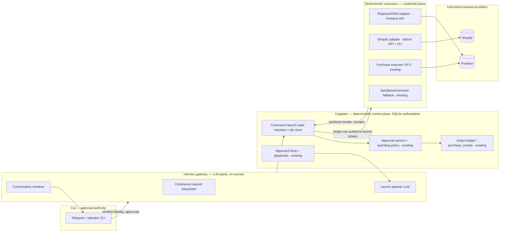
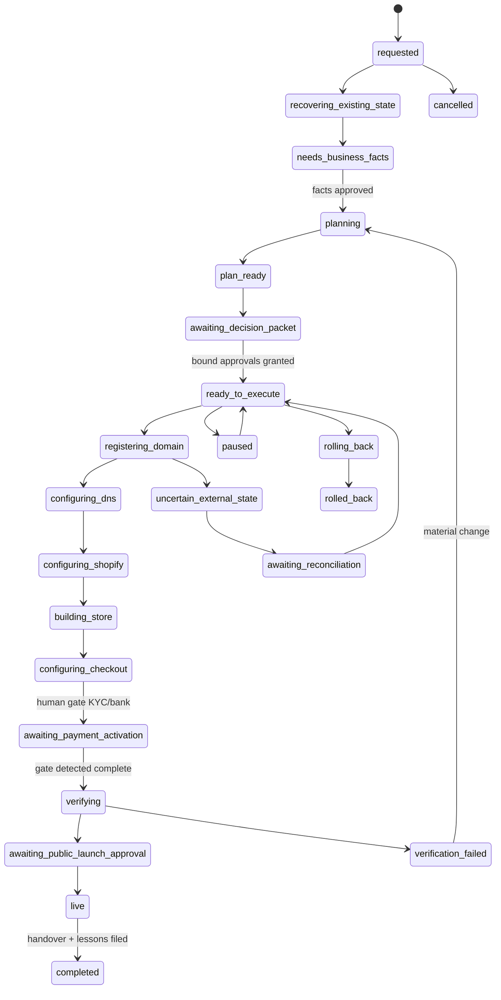

# Governed Ecommerce Launch Executor — Architecture, Security, Provider, Product & Implementation Review

**Handover packet for Codex. Produced 2026-07-24 by Fable (Claude Code). Research/audit only — no code, branches, purchases, or provider mutations were made.**

Evidence tags: **[V]** = verified in repository/GitHub; **[D]** = current official/provider doc (date-sensitive); **[I]** = inference, not verified.

---

## 1. Recovered state

### hermes-agent (`/home/v0id/.hermes/hermes-agent`) [V]
- Branch `main` @ `5600ea084`, clean, behind `origin/main` by 1 (fetch-only lag; safe to `git pull --ff-only`).
- Remotes: `origin` = `3ndym10n/hermes-agent`, `upstream` = `NousResearch/hermes-agent` (fork).
- Worktrees: `hermes-agent-bulk-style` (detached `8bd8bfe60`, clean), `hermes-agent-google` (`feat/linxio-selected-source-lessons`, in sync; two zero-byte junk files `--auth-code`, `--service-profile` from a mis-quoted CLI call — no secrets, safe to delete), `/tmp/hermes-intelligent-intake-x-article-recovery` (clean).
- Open issues: **#65** (purchase executor epic — deliberately open pending live acceptance), #77 (Linxio), #43 (async research replies). No open PRs; no closed-unmerged PRs.

### Cogitator (`/home/v0id/Projects/Cogitator_clean`) [V]
- Checked out on `agent/purchase-operator-bridge-v0` @ `809db08` — **merged into `origin/main`**; checkout is 7 commits behind main. Nothing stranded.
- `feat/purchase-ticket-terms-v0` is **patch-equivalent merged** (`git cherry` = `-`; main contains ticket-terms/checkout-terms binding). `feat/purchase-checkout-target-v0` merged.
- Untracked: `docs/hermes/`, `storage/intake/*` capture files — intake data, not code; leave alone.
- ~19 worktrees (lanes 557–572, 606/607, purchase-*, linxio) — all clean. Stale; candidates for later `git worktree prune`.
- Open PRs #794, #793 (June, stale, unrelated). Open issues include **#1003 "Agentic Intelligence Flywheel for AMD AI Hardware Venture"**, #1019 ISB V1.

### Purchase-executor status — the load-bearing finding [V]

The governed outgoing-purchase stack **exists, is merged, and is the correct foundation**:

| Layer | Where | State |
|---|---|---|
| Governance control plane | Cogitator `cogitator_purchase_governance.py` (1,871 lines) + `docs/PURCHASE_GOVERNANCE_V1.md` | Merged. SQLite-authoritative; policy `website_launch_v1` (AUD, A$100 pilot budget); exact-quote approval; atomic BEGIN IMMEDIATE reservations; single-use hashed execution tickets (5-min TTL, audience-bound); 15-min approval TTL; idempotency fingerprints; term-mismatch ⇒ approval+ticket invalidation; uncertain-result reconciliation; sanitized receipts (`restricted/purchase_receipts`, SHA-256, PAN/CVV/OTP redaction, forbidden-field rejection); refunds; asset registry; append-only `purchase_events` |
| Executor | hermes `purchase_executor.py` (1,322) + `purchase_discovery.py` + `purchase_merchants.py` | Merged (V0.3, PR #76 `0bfbec94b`). One-shot, deterministic, **no model calls**; runs outside gateway; credentials only from systemd `$CREDENTIALS_DIRECTORY` at fill time; single submit; pre-submit revalidation of price/currency/item/recurrence; CAPTCHA/3DS ⇒ fail/uncertain, never bypassed; one terminal callback with 0600 spool fallback; cleanup on every path incl. SIGTERM; fake-E2E confined to loopback |
| Packaging | hermes `packaging/purchase-executor/` | Merged. Hardened systemd units (`LoadCredentialEncrypted`, `NoNewPrivileges`, `ProtectSystem=strict`), `cal-gate.sh` sudo gate, synthetic staging, doctor/install/uninstall |
| Operator surface | hermes `scripts/purchase_operator_cli.py`; Cogitator operator bridge (`809db08`) | Merged. propose → preview → approve (confirmation phrase) → issue (ticket piped to root launch helper, never displayed) → status/cancel/revoke; 0600 audit JSONL |
| Tests | 1,309-line executor suite + governance/dry-run/bridge suites | Per issue #65 comment (2026-07-22): 108 purchase tests + 11 sandbox regressions pass; two Chromium fake-E2Es pass; independent Security & Build reviews **PASS** |

**Unfinished [V]:** the canonical acceptance gate — **one Cal-supervised real purchase** — has never run. Production Porkbun is fail-closed (no verified live cart path / session handoff; live merchant allowlist = Porkbun only). `systemd-creds` credential staging is a Cal-sudo step not yet done. **Complete the supervised A$≤30 live purchase as the first milestone of commerce-launch work — it doubles as the domain-registration acceptance test.**

### AMD/business knowledge in Cogitator [V]
- Approved record `storage/promoted/2026-06-30-ai-first-ecommerce-validation-playbook.md`: **validate demand (preorder/deposit/waitlist) before building store infrastructure** — endorses preorder-first, warns against overbuilding.
- `docs/research/RAW_BUSINESS_AI_GPU_INTAKE_PACKET_V0.md` explicitly notes **no actual GPU/AMD/supplier facts exist in Cogitator**. No business name, brand, domain, supplier, pricing, warranty, or preorder-term facts on record — all are missing-facts gates for the first launch.
- No prior domain or business-name decision found anywhere [V].

---

## 2. Payment-boundary review

**Verdict: the two payment systems are already structurally separated; nothing in the repo conflates them.** [V]

- **A. Virgil's outgoing purchases** — fully covered by the stack above. Purchase classes `{domain, hosting, dns, essential_service}`; Shopify subscription / theme fit via policy extension. Exact price/currency/term/renewal/auto-renew binding, idempotency, one-shot, receipts, uncertain-reconciliation exist and are tested. **Reuse as-is; extend only the policy (budget, classes) and merchant allowlist.**
- **B. Customer payments** — no code anywhere touches customer checkout; keep it so. Shopify Checkout + Shopify Payments keep card data entirely within Shopify's PCI scope; Virgil only reads *order objects* via Admin API. Rules for Codex:
  - Test orders use Shopify's **Bogus Gateway / test mode** with documented test cards only — never a real card, never through the purchase executor.
  - The browser-fallback executor must be domain-blocked from customer payment pages.
  - The Shopify adapter never invokes the purchase executor; test-checkout verification is an Admin-API/test-gateway concern. (This closes the one residual risk: semantic checkout discovery pointed at the store's own checkout.)

---

## 3. Capability map

Legend: ✅ verified complete · 🟡 partial · 🧪 prototype · 📄 documented but absent · ❌ missing · ⛔ unsuitable. Slice = §13.

### Orchestration

| Capability | State | Evidence | Reuse | Repo | Slice |
|---|---|---|---|---|---|
| NL job creation | 🟡 | gateway routes NL → durable Cogitator research jobs (#62) [V] | pattern | hermes | S2 |
| User identity verification | ✅ | `gateway/authz_mixin.py`; Telegram fail-closed allowlist (`TELEGRAM_ALLOWED_USERS`, deny-by-default) [V] | as-is | hermes | — |
| Project recovery before creation | ❌ | none for commerce | — | — | S2 |
| Structured launch brief / fact validation | ❌ | — | — | — | S2 |
| Durable job state | 🟡 | Cogitator SQLite lifecycle patterns [V]; no commerce job | pattern | Cogitator | S2 |
| Job status/continuation/cancel | 🟡 | purchase lifecycle has status/cancel/revoke [V] | pattern | Cogitator | S2 |
| Rollback / expiry | 🟡 | approval/ticket TTLs [V]; job-level rollback absent | — | Cogitator | S6 |
| Restart / partial-failure recovery | 🟡 | claimed-ticket ⇒ human reconcile; spool [V]; job resume absent | pattern | both | S2 |
| Uncertain-state reconciliation | ✅ | `record_uncertain_result`/`reconcile_uncertain_result` + reservation retention [V] | as-is | Cogitator | — |
| Resumability after human gates | ❌ | — | — | — | S2 |
| Idempotent actions | ✅ | idempotency keys + request fingerprints [V] | as-is | Cogitator | — |
| Duplicate-job prevention | 🟡 | per-proposal idempotency [V]; job-level absent | pattern | Cogitator | S2 |
| Plan fingerprinting / change invalidation | ✅ (purchase scope) | term-mismatch invalidates approval+ticket [V] | extend | Cogitator | S2 |

### Governance

| Capability | State | Evidence | Slice |
|---|---|---|---|
| Approval tokens, one-time use, expiry, replay prevention, stale rejection | ✅ | hashed single-use tickets, TTLs, constant-time compare, terminal-state checks [V] | reuse |
| Human approval identity | 🟡 | confirmation phrase + Telegram allowlist; `approver` recorded, not cryptographically bound | S3 |
| Exact-action & exact-cost binding | ✅ | approval = exact quote; ticket bound to merchant/item/qty/max/currency/recurrence [V] | reuse |
| Recurring-subscription disclosure | ✅ | `commitment_type`, `billing_interval`, `renewal_amount/date`, `auto_renew`, `cancellation_deadline` required [V] | reuse |
| Per-action limits / per-job budgets | ✅ | policy caps + `purchase_budgets`; needs `commerce_launch_v1` policy | S1 |
| Provider/account allowlists | 🟡 | merchant allowlist = Porkbun only [V]; account allowlist ❌ | S3 |
| Public-launch / contract / payment-activation approvals | ❌ | — | S5/S6 |
| Receipt storage & audit trail | ✅ | restricted receipts, `purchase_events`, executor JSONL, operator audit [V] | reuse |

### Provider execution

| Capability | State | Evidence | Slice |
|---|---|---|---|
| Provider adapter model | 🟡 | `MerchantAdapter` dataclass — checkout-shaped, not API-shaped [V] | S1 |
| Registrar adapter (API) | ❌ | only browser-checkout Porkbun | S1 |
| DNS adapter | ❌ | `domain-intel` skill is read-only OSINT [V] | S4 |
| Shopify adapter / Admin API / CLI-theme | ❌ / 📄 | only `optional-skills/productivity/shopify/SKILL.md`, no code [V] | S5 |
| Payment-readiness adapter | ❌ | — | S6 |
| Browser fallback | ✅ | sandboxed local browser (sandbox_bypass: never, no recording, no private URLs [V]); cleanup_browser API | reuse |
| Provider-account verification | ❌ | — | S3 |
| API version pinning / rate limits / webhooks / polling | ❌ | — | S4/S5 |

### Domain & infrastructure
All ❌ except: availability/price lookup covered by Porkbun API [D]; the **purchase leg** of registration ✅ via executor. DNS read/diff/mutate/rollback, email-record preservation, Shopify connection, SSL/redirect verification, propagation monitoring, SPF/DKIM/DMARC: ❌ (S4).

### Shopify
All ❌ (no code). Verified constraints [D]: store creation has **no public API** (dev stores are Partner-Dashboard-manual); paid-plan transition and Shopify Payments KYC are owner actions; preorder/deposit needs a selling-plan app (deferred purchase options, `sellingPlanGroupCreate`) or an existing app (e.g. Downpay); excludes local payment methods/B2B/draft orders. Theme via Shopify CLI + git is ✅-able. (S5.)

### Website generation
❌ except: Cogitator approved-fact retrieval ✅ (retrieval records w/ trigger phrases [V]); ISB grounding checks [V] reusable for **unsupported-claim prevention** (copy may only assert approved facts). (S5.)

### Security & operations

| Capability | State | Evidence |
|---|---|---|
| Secret storage | ✅ | systemd `LoadCredentialEncrypted` + `/etc/credstore.encrypted` (payment); `~/.hermes/secrets` 0700 (API keys) [V] |
| Credential isolation from LLM | ✅ | creds never in env/argv/logs/bridge payloads [V] |
| Browser profiles/sessions | ✅ | `~/.hermes/browser-profiles`, sandboxed config [V] |
| Command logging / audit | ✅ | executor JSONL, operator audit, purchase_events [V] |
| Prompt-injection resistance | 🟡 | deterministic executor immune by construction; provider-pages-as-untrusted-data must be a stated rule in new adapters |
| Egress/allowed-domain controls | 🟡 | executor origin allowlist [V]; no general egress policy |
| Kill switch | 🟡 | `systemctl disable --now` + ticket revocation [V]; no single commerce kill switch |
| Renewal alerts / subscription inventory | ✅/❌ | `purchase_assets` registry with renewal data [V]; alerting job ❌ |
| Incident response / backups / monitoring | 🟡 | `~/.hermes/backups`, state-snapshots exist [V]; no commerce runbook |

### Cogitator

| Capability | State | Evidence |
|---|---|---|
| Approved facts / retrieval / provenance / review / no-auto-promotion / bounded retrieval | ✅ | promoted records, lesson-candidate flow, ISB grounding, promotion approval bridge [V] |
| Business profile / product facts / pricing / brand for AMD venture | ❌ | explicitly absent [V] |
| Commerce launch playbooks | 🟡 | one approved validation playbook [V] |
| Launch handover / post-launch outcome capture | ❌ | lesson-candidate flow reusable |
| Not a credential store | ✅ | forbidden-field rejection at schema level [V] |

---

## 4. Source-of-truth matrix

| Data | Authoritative owner | Notes |
|---|---|---|
| Business identity, ABN, legal name | Cal + government registries; cached as approved Cogitator facts with provenance | auDA/Shopify verify independently |
| Brand, product facts, pricing, warranty, preorder terms, supplier facts | Cogitator approved records (human-reviewed) | copy generator may cite only these |
| Job state, plan fingerprint, gate status | Cogitator SQLite (extend purchase-governance DB with commerce-job tables) | evidence supports SQLite over Markdown [V] |
| Approval state, budgets, reservations, tickets | Cogitator SQLite (existing tables) [V] | |
| Provider credentials, payment instrument | systemd credstore / `~/.hermes/secrets` — never Cogitator, never LLM [V] | |
| Domain ownership, DNS state, Shopify live state, payment readiness | Provider APIs — always re-read, never trusted from cache | reconciliation = job expectation vs provider truth |
| Theme code, deterministic adapters | Git | theme rollback = git revert + redeploy |
| Product configuration | Shopify Admin API live; desired-state spec in git/job | |
| Customer order / card data | Shopify only; Virgil reads order summaries, stores nothing card-related | PCI boundary |
| Receipts | restricted artifact store (path+hash in Cogitator) [V] | |
| Recurring subscriptions | `purchase_assets` [V] + provider truth | |
| Human approval authority | Cal via approval record (operator CLI / Telegram) [V] | |
| Launch handover, post-launch lessons | Cogitator lesson-candidate review (no auto-promotion) [V] | |

Amendment to the proposed pattern, supported by evidence: **execution/job state belongs in Cogitator's governed SQLite, not in Hermes** — that is where lifecycle, idempotency, and approval machinery already live and are tested [V]. Hermes holds only transient conversation state and the executor's local spool.

---

## 5. Architecture recommendation (single, smallest sound)

**Extend the proven purchase-governance triangle (Cogitator control plane ⇄ Hermes gateway ⇄ one-shot deterministic executors) with a Commerce Launch job layer and three API adapters. No new services, queues, or databases.**

Trust boundaries: (1) Cal↔Hermes: fail-closed identity allowlist; (2) Hermes↔Cogitator: bearer-token bridge, structured actions only, LLM output = proposals; (3) Cogitator↔executors: hashed single-use audience-bound tickets; (4) executors↔providers: origin allowlists, provider pages/responses untrusted; (5) credentials exist only inside executor units and never cross inward.

### Components (responsibility · reuse · owner · boundary · failure)

| Component | Responsibility | Existing code to reuse [V] | Repo | Prohibited data / boundary | Failure behaviour |
|---|---|---|---|---|---|
| Commerce request interpreter | NL → typed `LaunchRequest`; classify new/continue/repair | gateway routing pattern (#62 research jobs) | hermes | no secrets; output is a proposal | reject unparseable → ask |
| Project recovery scanner | enumerate existing jobs, assets, domains, stores before creating anything | `purchase_assets`, ledger reads | Cogitator | read-only | report partial recovery, never guess |
| Business-fact resolver | pull approved facts; emit missing-facts packet | retrieval records + trigger phrases | Cogitator | never auto-promote | block planning on gaps |
| Launch planner (LLM) | one recommended plan + costs; content drafts | new prompt work | hermes | never sees credentials; can't self-approve | plan rejected → revise |
| Commerce launch state machine + job store | versioned states, plan fingerprint, gate ledger | purchase lifecycle tables, `init_db` additive migrations | Cogitator | no card data (forbidden-field schemas exist) | crash ⇒ resume from SQLite; unknown ⇒ `uncertain_external_state` |
| Approval service + spending-policy evaluator | **exists** — add `commerce_launch_v1` policy (budget; classes incl. `saas_subscription`, `app_subscription`, theme), plan-level fingerprints | `cogitator_purchase_governance.py` | Cogitator | as today | as today |
| Action ledger / audit writer | **exists** — `purchase_events` + executor JSONL | same | Cogitator | sanitized only | append-only |
| Registrar/DNS adapter | Porkbun API v3: availability, pricing, register (payment via purchase governance), DNS CRUD, nameservers, auto-renew | executor packaging pattern (one-shot unit, creds via credstore) | hermes | API keys only in unit; responses untrusted | fail-closed; uncertain ⇒ reconcile |
| Shopify adapter | Admin GraphQL (pinned version), product/page/policy/order reads+writes; theme via Shopify CLI from git | credential_files/env patterns; browser fallback for dashboard-only steps | hermes | Admin token in credstore; **never customer card data** | idempotent upserts; verify-after-write |
| Payment-readiness coordinator | detect Shopify Payments state via Admin API; drive human KYC gate; test checkout via test mode | gate pattern from purchase flow | hermes+Cogitator | never touches card forms | gate until provider confirms |
| Theme/page builder | generate theme/sections/copy **only from approved facts**; git-committed; placeholder detection | ISB grounding checks for claim verification | hermes | no unapproved claims | build fails on ungrounded claim |
| Browser fallback executor | **exists** — sandboxed browser for dashboard-only steps, screenshot evidence | browser tool + cleanup | hermes | per-step domain allowlist; no payment pages | abort ⇒ human gate |
| Human-gate coordinator | one exact action to Cal; detect completion by **provider re-read**, not Cal's word | Telegram approval-button bridges | hermes | — | timeout ⇒ paused |
| Reconciliation worker | compare job expectation vs provider truth after interrupt/uncertainty | `reconcile_uncertain_result` | Cogitator | — | human decision on conflict |
| Verification engine | DNS/SSL/redirect/store/checkout/email checklist; screenshots + API evidence | browser + adapters | hermes | read-only | `verification_failed` with evidence |
| Rollback coordinator | per-action inverse where one exists (DNS snapshot restore, theme git revert, store re-password); **domain purchases not rollback-safe** | DNS snapshots (new), git | hermes | — | irreversible steps listed in decision packet |
| Cogitator retriever / lesson handoff | **exists** — bounded retrieval; lesson candidates post-launch | ISB flow | Cogitator | no auto-promotion | — |
| Conversation renderer | compact packets (§8) | existing bridge renderers | hermes | — | — |

Test strategy for all new components mirrors the proven pattern [V]: injectable fake bridge/provider seams; offline dry-run harness (extend `cogitator_purchase_dry_run.py`); one fake-E2E per adapter against loopback fixtures; asserted-cleanup tests.

---

## 6. Planner/executor separation & action schemas

House style already [V]; carry forward verbatim: LLM proposes → deterministic Python validates against schema + policy → human approves consequential actions → executor performs with single-use ticket → sanitized result returns. Provider pages/responses and generated marketing copy are data, never instructions; approvals live only in Cogitator SQLite and cannot be modified by any provider response path. The LLM never receives raw credentials and never approves its own actions.

Envelope for all actions: `job_id`, `action_id`, `idempotency_key`, `plan_fingerprint`, `provider`, `account_ref`, `requires_approval`, `approval_ref?`.

| Action | Key fields | Consequential? |
|---|---|---|
| `domain.search` | `keywords`, `tlds[]`, `max_results` | no |
| `domain.register.preview` | `domain`, `registrar`, `term_years`, `initial_price`, `renewal_price`, `currency`, `privacy`, `auto_renew`, `taxes_fees`, `nameserver_plan`, `refund_terms`, `transfer_restrictions` | no (produces approval packet) |
| `domain.register` | preview hash + purchase-governance `proposal_id` | **yes — exact-bound, via existing purchase flow** |
| `dns.change.preview` | `zone`, `desired_records[]`, computed `additions/changes/deletions`, `preserved[]` (MX/SPF/DKIM/DMARC/TXT-verification), `snapshot_id` | no |
| `dns.apply` | `preview_hash`, `snapshot_id` | yes if deletions/changes touch mail or existing site |
| `shopify.store.discover` | `account_ref` | no |
| `shopify.product.upsert` | `store_id`, `product_spec` (handle-keyed, idempotent) | no |
| `shopify.page.upsert` | `store_id`, `page_spec`, `facts_provenance[]` | no |
| `shopify.theme.deploy` | `store_id`, `git_ref`, `theme_role: unpublished→publish` | publish = yes |
| `payments.readiness.check` | `store_id` | no |
| `checkout.test` | `store_id`, `gateway: test_mode_only` (hard-coded) | no |
| `launch.verify` | `checklist_version` | no |
| `launch.public` | `store_id`, `domain`, verification hash | **yes** |
| `job.rollback` | `job_id`, `actions[]` with per-action reversibility flags | yes |

---

## 7. Commerce job state machine (v1)

`state_machine_version=1`, persisted in Cogitator SQLite, every transition an event in the ledger. Timeout default 72 h → `paused`. Retries: **never** for consequential/irreversible actions (house rule [V]); idempotent reads 3× with backoff.

| State | Entry | Allowed actions | Approval needed | Exit | User message |
|---|---|---|---|---|---|
| requested | Cal verified + typed request | recovery scan | — | scan done | "Checking what already exists…" |
| recovering_existing_state | scan started | provider reads | — | report built | recovered-state report |
| needs_business_facts | gaps found | fact packet | Cal answers | facts approved | missing-facts packet |
| needs_provider_choice | multiple viable accounts/providers | recommend one | Cal picks/accepts default | chosen | provider recommendation |
| planning → plan_ready | facts complete | LLM plan; cost research | — | plan fingerprinted | — |
| awaiting_decision_packet | plan ready | render packet | **all bound approvals** (budget, domain purchase, subscriptions) | approvals granted | decision packet |
| ready_to_execute | approvals live + fingerprint matches | dispatch next safe action | per-action | step dispatched | job status |
| registering_domain | domain approval live | purchase-governance flow (existing) | already bound | asset recorded / uncertain | "Registering {domain}…" |
| configuring_dns | domain owned | dns.preview/apply, snapshot | if consequential diff | records verified | DNS diff summary |
| configuring_shopify / building_store / configuring_checkout | store reachable, account verified | upserts, theme deploy (unpublished), test checkout | theme purchase/app subscription = yes | verified per step | progress |
| awaiting_account_link / awaiting_login / awaiting_2fa / awaiting_contract_acceptance / awaiting_kyc / awaiting_bank_details / awaiting_payment_activation | executor hit a human-only wall | poll provider for completion | — (Cal acts on provider) | provider re-read confirms | human-gate card: one exact action |
| verifying | build complete | checklist run | — | pass/fail | verification report |
| verification_failed | check failed | diagnose, re-plan | re-approval if material | back to planning/execute | failure + evidence |
| uncertain_external_state → awaiting_reconciliation | interrupted write, unknown outcome | provider re-read only | human decision if conflicting | reconciled | uncertainty warning |
| awaiting_public_launch_approval | verification passed | render launch packet | **public-launch approval** | approved | launch approval card |
| live | password removed / domain live | post-launch checks | — | handover done | — |
| completed | handover + lesson candidates filed | — | — | terminal | handover |
| paused / cancelled / rolling_back / rolled_back / failed | operator or timeout | resume / inverse actions | rollback approval | terminal or resume | rollback proposal |

**Material plan changes that invalidate approvals** (fingerprint fields): domain name/TLD/registrar/account, any price or currency, term, auto-renew, recurrence of any subscription, provider account substitution, Shopify plan tier, product price/deposit amount, launch date. Non-material (copy edits, theme styling, page order) do not invalidate. Approvals are per-action and bound to per-action hashes, so unchanged actions keep their approvals; only changed actions are re-requested.

---

## 8. Interaction design (condensed exemplar)

> **Cal:** Launch a Shopify preorder store for discounted AMD GPUs. Find a domain, build the site and connect payments.

> **Virgil:** *(identity: Telegram allowlist ✅)*
> **Recovered state:** No existing launch job. Purchase governance live (A$100 budget, A$0 spent). No domain, Shopify store, or approved GPU business facts on record. One relevant playbook: validate demand via preorder before overbuilding — this request fits it.
> **Missing facts (7):** legal entity/ABN for .com.au & Shopify Payments · brand name · exact GPU SKU + preorder price + deposit amount · fulfilment/refund terms · supplier claim I may state publicly · warranty · support email.
> Reply inline, e.g. "ABN 12 345 678 901, brand '…', deposit A$100, …".

> **Cal:** *(answers)*

> **Virgil:** **Decision packet — GPU preorder launch v1** *(plan fp `a1b2c3`)*
> 1. **Domain** gpudirect.com.au — Porkbun, **A$X initial / A$Y renewal** (AUD, 1 yr, WHOIS privacy, auto-renew ON, no refund after registration) — needs purchase approval. Alt: gpudirect.com A$Z.
> 2. **Shopify Basic** — ~A$56+GST/mo monthly [date-sensitive] — **recurring**, needs subscription approval.
> 3. **Preorder deposits** via Downpay app (A$…/mo) — recurring, needs approval.
> 4. Build: theme from git, pages, policies, 1 product w/ A$100 deposit plan, password-protected preview, test checkout in test mode.
> **You personally must (later):** create the store login, accept Shopify ToS, complete Shopify Payments identity+bank (KYC), approve public launch.
> Reply e.g. "approve all", or amend anything.

> **Cal:** Approve everything except use domain B and set the deposit to A$100.

> **Virgil:** Domain switched to B ⇒ domain-purchase approval re-bound (new price A$Z — confirm). Deposit A$100 changes product config only — not approval-material. Shopify + Downpay approvals **unchanged and preserved**. Confirm domain B at A$Z? *(one word)*

> …execution…
> **Human gate 1/2 — Shopify Payments:** open Settings → Payments → Complete account setup; have driver's licence + BSB/account ready. I'll detect completion automatically and continue. *(polls `payments.readiness.check`)*
> …
> **Verification passed (14/14)** — DNS ✅ SSL ✅ www→root ✅ test order+refund ✅ emails ✅ policies ✅ no placeholder text ✅. Preview link + password: … **Approve public launch?**
> …
> **Handover:** domain (renews {date}, A$Y), subscriptions table, admin URLs, evidence bundle, 3 lesson candidates filed for review.

Format rules: every packet ≤ ~15 lines; one decision per message; exact amounts+currency always; recurring items always show renewal date and cancel deadline; uncertainty messages always state "what I know / what I don't / what I will not retry".

---

## 9. Provider-account verification

Rule (generalize the merchant-binding pattern [V]): before any consequential action, the adapter re-reads account identity from the provider API and matches it against the approval's `account_ref`; mismatch ⇒ invalidate pending approvals for that provider. Never infer accounts from filenames, repo clues, usernames, old messages, or local paths.

- **Porkbun:** auth check + domain list; per-key IP/domain restrictions available [D]. Record key fingerprint, not the key.
- **Shopify:** Admin GraphQL `shop { id, name, email, myshopifyDomain, currencyCode, plan { partnerDevelopment } }` — verifies store id, domain, currency, and dev-vs-paid environment in one query [D].
- Environment tag (`test|development|production`) stored on the account record; production writes refuse against a dev-tagged account and vice versa.

---

## 10. Registrar research & recommendation

| | **Porkbun** (primary) | **Cloudflare Registrar** (fallback) | Namecheap | Synergy Wholesale / VentraIP (AU) |
|---|---|---|---|---|
| Registrar API incl. registration | ✅ v3: availability, pricing, registration (`getRegistrationRequirements/{tld}` gates API-registerable TLDs), DNS CRUD, SSL, forwarding [D] | ✅ new Registrar API (2026, beta): search/availability/register [D] | ✅ but account minimums + IP whitelisting; sandbox exists [D-known, verify] | Synergy: reseller API w/ sandbox, .au specialists [I — verify before use] |
| Auth | API key + secret headers; per-key IP/domain restrictions; works with 2FA on [D] | CF API token | key + whitelisted IP | key + IP |
| .com | ✅ ~US$9.7 flat reg=renewal [D, date-sensitive] | ✅ at-cost | ✅ | ✅ |
| .au / .com.au | `.au` sold (porkbun.com/tld/au); **.com.au unverified — check `getRegistrationRequirements/com.au` at build time** | not evidenced [I] | not offered [I] | ✅ core business |
| WHOIS privacy / SSL / DNSSEC | free [D] | free/at-cost | paid tiers | varies |
| Shopify connection | plain A/AAAA/CNAME — clean | **requires Cloudflare NS**; proxy must be DNS-only for Shopify [I-known] | clean | clean |
| Existing integration | **already the allowlisted merchant of the purchase executor, with sanitized checkout fixture** [V] | none | none | none |

**Recommendation:** **Porkbun API primary** — only registrar with (a) official registration+DNS API without account minimums, (b) an existing security-reviewed place in the purchase-governance allowlist [V], (c) transparent flat pricing. Registration goes through the API leg with the existing purchase-governance approval wrapped around it; browser executor stays as fallback. **Fallback: Cloudflare Registrar** for .com-class only.

**.com.au:** eligibility requires Australian presence — valid ABN/ACN/ARBN or exact-match trademark; losing it can cancel the licence within 24 h (auDA). Registrar/auDA validate — this is their legal call, not Virgil's. If Porkbun can't API-register .com.au, add an AU registrar (Synergy Wholesale, sandbox) *only when Cal actually wants .com.au*.

Cal must: supply ABN/registrant details, approve exact price/renewal. Virgil automates: search, pricing, preview, registration call, DNS, lock, auto-renew config. **Not rollback-safe:** the registration payment (refunds registrar-specific, often nil) — disclosed in preview.

Domain purchase preview must show: exact domain, TLD, registrar, account, initial price, renewal price, currency, term, privacy, auto-renew, taxes/fees, transfer restrictions, refund limitations, nameserver plan. (All fields already exist in `PROPOSAL_FIELDS` or map onto it [V].)

---

## 11. DNS & domain safety

Desired-state diff engine (small, deterministic): fetch all records → classify (MX/SPF/DKIM/DMARC/TXT-verification/NS = **protected**; existing A/CNAME on apex/www = **flagged**) → compute add/change/delete → snapshot full zone JSON (rollback state, kept with the job) → render diff → bind approval to diff hash when deletions or protected-class changes exist → apply → verify by re-read + resolution checks.

Shopify connection facts [D]: apex A `23.227.38.65`, AAAA `2620:0127:f00f:5::`, `www` CNAME `shops.myshopify.com.`; only one A/CNAME pair allowed; up to 48 h propagation. Handle: TTL-aware waits; partial-propagation retest from multiple resolvers; SSL-issuance polling in Shopify admin; root/www redirect check both directions; never change NS unless the plan says so (protected class — accidental NS replacement is the classic mail-killer); transfer-lock ON after registration; email-record deletions are default-deny.

---

## 12. Compliance notes

- **PCI:** Virgil stays entirely outside the CDE (§2). Shopify Checkout is PCI compliant; test orders via test gateway only.
- **auDA:** .com.au eligibility + 24 h-cancellation exposure — keep the ABN fact fresh in Cogitator with provenance; surface at renewal.
- **Australian Consumer Law (preorders/deposits):** refund terms, delivery-time claims, and "discounted" price claims must come from approved facts only; the unsupported-claim gate is the enforcement point. Preorder terms/refund policy are Cal's legal call. [I — not legal advice]
- **Shopify Payments AU:** identity + banking verification is a personal Cal gate (owner sets up in admin). Deposits/preorder use deferred purchase options — excludes local payment methods, B2B, draft orders [D].

---

## 13. Implementation slices (ordered)

- **S0 (gate, Cal-supervised, no new code):** finish issue #65's acceptance — stage credentials via `systemd-creds`, configure the verified Porkbun cart path, run the supervised live A$≤30 purchase. Everything downstream reuses this machinery; prove it live first.
- **S1 — Porkbun API adapter + `commerce_launch_v1` policy:** availability/pricing/registration-requirements reads; registration via API wrapped in existing proposal→approval→ticket flow; extend policy classes (`saas_subscription`, `app_subscription`, theme) and budget. New one-shot executor module in the proven packaging shape.
- **S2 — Commerce job store + state machine + interpreter:** additive SQLite tables next to purchase governance; plan fingerprinting generalizing existing term-fingerprint code; recovery scanner; missing-facts packet; Telegram rendering via existing bridge patterns.
- **S3 — Provider-account verifier + account allowlists** (small; blocks all consequential writes).
- **S4 — DNS diff/snapshot/apply/verify + Shopify domain connection + propagation/SSL checks.**
- **S5 — Shopify adapter:** Admin GraphQL (pin current stable; quarterly bump policy [D]), product/page/policy upserts, theme repo + Shopify CLI deploy (unpublished→publish), grounded copy builder with claim gate, password-protected preview, test checkout.
- **S6 — Payment-readiness coordinator, human-gate polling, verification engine, public-launch approval, handover + lesson candidates, renewal-alert cron.**

**Open questions for Cal (block the acceptance case, not the build):** ABN/entity for .com.au & Shopify Payments; brand/domain shortlist; SKU/price/deposit/refund terms; supplier claims that may be public.

**Risks:** store creation is manual (no public API; dev stores are Partner-Dashboard-only [D]) ⇒ model as an early ~5-min human gate. Downpay/app dependency for deposits (building our own selling-plan app is bigger — don't do it first). All prices are **date-sensitive** — re-quote at preview time, never from cache. Cogitator's own approved playbook says validate demand before overbuilding [V] — preorder-first scope honors it; resist scope growth past one SKU/one offer.

---

## 14. Sources (all date-sensitive; fetched 2026-07-24)

- Porkbun API docs: https://porkbun.com/api/json/v3/documentation
- Porkbun .au: https://porkbun.com/tld/au
- Shopify connect domain manually: https://help.shopify.com/en/manual/domains/add-a-domain/connecting-domains/connect-domain-manual
- Shopify Payments requirements: https://help.shopify.com/en/manual/payments/shopify-payments/requirements
- Shopify Payments Australia: https://help.shopify.com/en/manual/payments/shopify-payments/supported-countries/australia
- Deferred purchase options (pre-order/deposits): https://shopify.dev/docs/apps/build/purchase-options/deferred
- GraphQL Admin API: https://shopify.dev/docs/api/admin-graphql
- Dev-store creation is dashboard-only (community confirmation): https://community.shopify.com/t/shopifys-apis-to-create-a-development-store-within-the-shopify-partner-dashboard/185228
- auDA .com.au rules: https://www.auda.org.au/au-domain-names/the-different-au-domain-names/com-au-domain-names/
- Cloudflare Registrar API launch: https://www.startuphub.ai/ai-news/technology/2026/cloudflare-api-now-lets-you-register-domains-programmatically
- Cloudflare TLD policies: https://domains.cloudflare.com/tld-policies
- Shopify AU pricing (third-party aggregators — verify at purchase): https://cybernews.com/au/best-website-builders-in-australia/shopify-pricing-australia/ · https://www.whitepeakdigital.com/blog/how-much-does-shopify-cost-in-australia/
- Porkbun pricing: https://www.stackscored.com/pricing/domain-registrars/porkbun/

---

**Bottom line:** ~70% of the hard, security-critical substrate (governed payments, approvals, tickets, budgets, receipts, reconciliation, sandboxed browser, identity gating, Cogitator knowledge flow) is merged, tested, and security-reviewed [V]. Genuinely new work: three API adapters, a commerce job layer on the existing SQLite patterns, and the verification engine. The single blocking gate before any of it matters is the supervised live purchase that issue #65 has been holding open.
